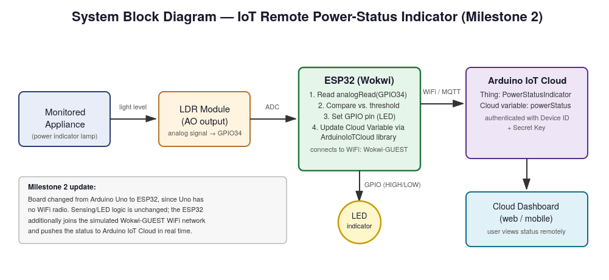
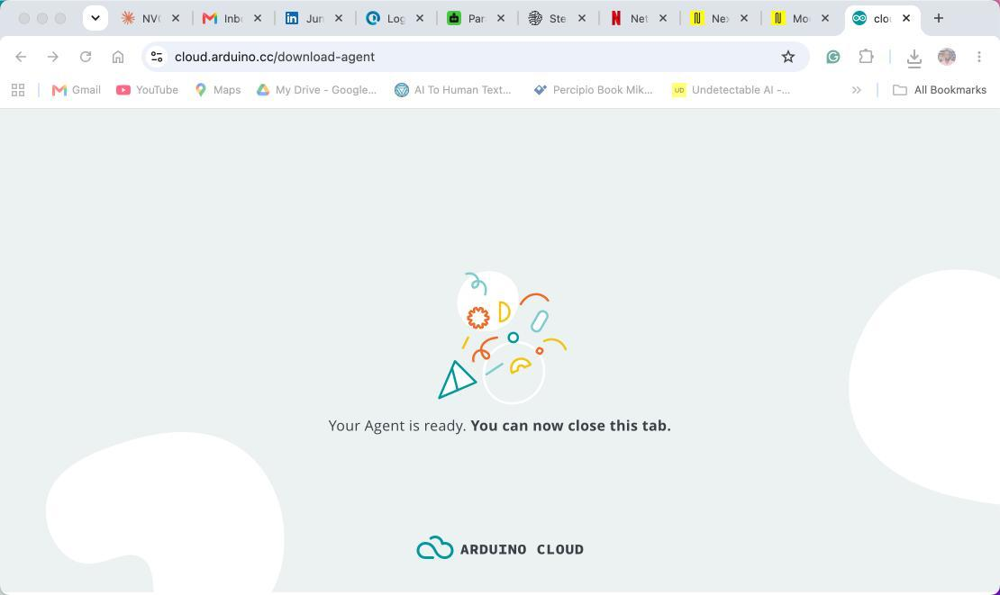
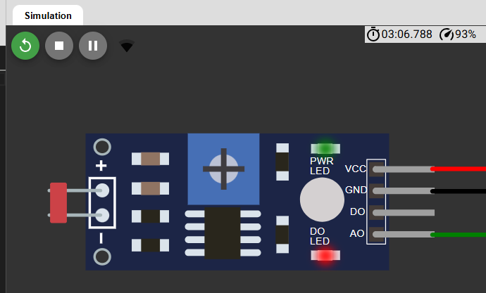
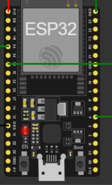

# IoT Remote Power-Status Indicator — with Security Assessment

A low-cost IoT sensor that reports appliance power status to Arduino IoT Cloud, built for regions with unreliable grid electricity. Extended into a cybersecurity portfolio project with a full security assessment covering the device, network, and cloud layers.

## The Problem

Households and small businesses that depend on unreliable grid electricity rely on backup devices — inverters, freezers, water pumps, generators — but the only way to know if these are actually powered on is to physically walk over and check them. When the owner isn't on site, food can spoil, water tanks can dry out, and batteries can drain without anyone realizing.

This project solves that with a low-cost remote sensor: it detects when a monitored appliance is powered on or off, and communicates that status to Arduino IoT Cloud so it can be viewed from any browser or phone.

## Architecture

**Stack:** ESP32 · LDR sensor · Arduino IoT Cloud · MQTT over TLS · Wokwi (simulation)

## Build

Simulated in Wokwi with an ESP32, LDR module, LED indicator, and pushbutton for manual test override.

Once the ESP32 authenticates to Arduino IoT Cloud using its Device ID and Secret Key, the `powerStatus` cloud variable syncs in real time to the dashboard.

The status is viewable from any browser or mobile device — the whole point of the project.

## Security Assessment

This project is being extended into a cybersecurity portfolio piece. The security scope covers three layers: the device (ESP32 firmware and storage), the network (WiFi and MQTT traffic), and the cloud (Arduino IoT Cloud authentication and data integrity).

**Threat model:** [`security/threat-model.md`](security/threat-model.md) — STRIDE-based assessment (in progress)
**Attack notes:** [`security/attack-notes.md`](security/attack-notes.md)
**Mitigations:** [`security/mitigations.md`](security/mitigations.md)

### Vulnerabilities identified (so far)

- Plaintext credentials in firmware source (`arduino_secrets.h`)
- Open WiFi network (`Wokwi-GUEST`) modelling insecure real-world deployments
- No integrity check on sensor state before cloud publish
- MQTT/TLS certificate handling not verified

### Mitigations planned

- Move secrets into ESP32 encrypted NVS (non-volatile storage)
- Certificate pinning for the Arduino Cloud connection
- Signed OTA (over-the-air) updates
- Anomaly detection on sensor readings

## Repository Structure
## Author

**Ajibade Banji Segun** — [LinkedIn](https://www.linkedin.com/in/banjiajibade/)
Cybersecurity student · IoT & embedded systems
